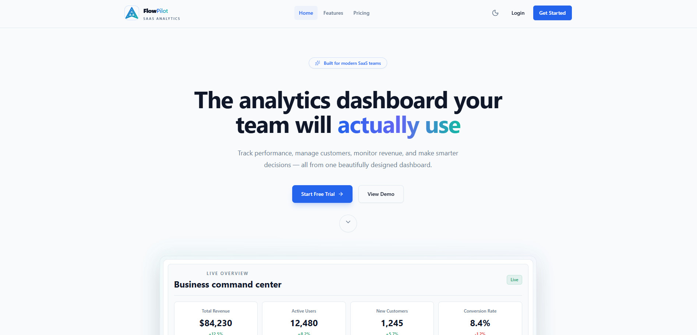
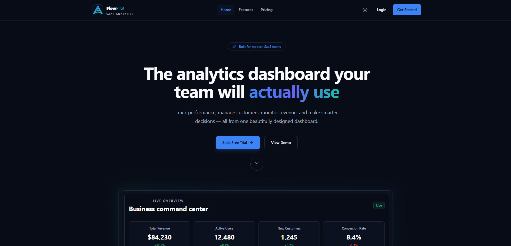
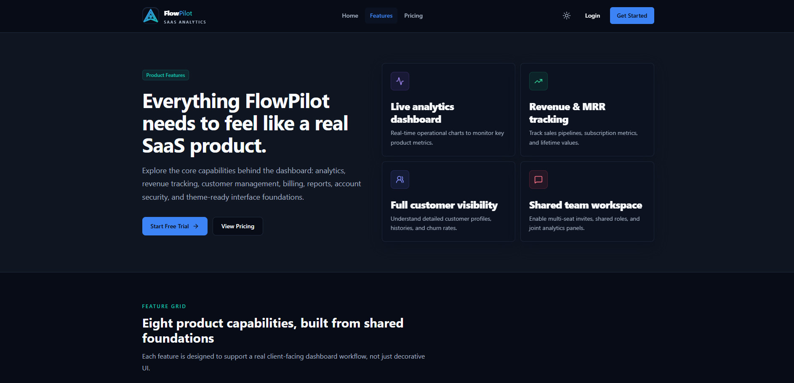
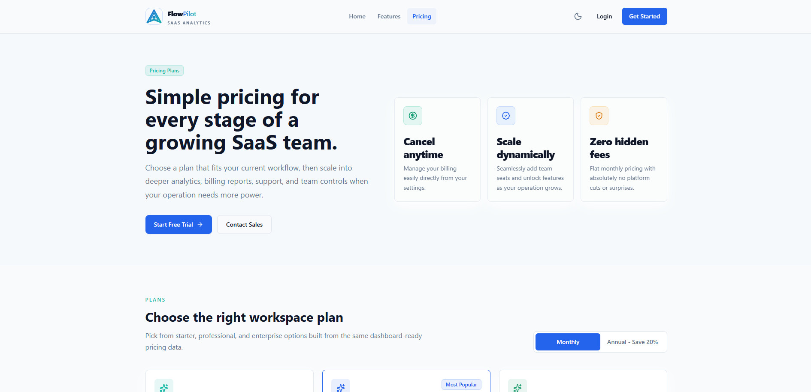

# ✈️ FlowPilot SaaS Dashboard

[](#)
[](#)
[](#)
[](#)
[](#)
[](#)
[](#)

FlowPilot is a premium, high-performance SaaS dashboard designed for modern product and growth teams who need real-time data visibility without the friction. It combines a conversion-optimized marketing landing page, secure simulated authentication flows, and a dense, beautiful, responsive administration panel featuring high-fidelity interactive state management, custom client-facing copy, accessibility (a11y) safeguards, and fluid staggered animations.

Designed and engineered with **React**, **TypeScript**, and **Tailwind CSS**, FlowPilot offers a pixel-perfect, premium look in both light and dark modes, backed by professional engineering practices like robust form validation, custom search indexes, global accessibility skip links, and instant UI responsiveness.

---

## ⚡ Core Features

### 💻 Marketing & Landing Pages

- **Interactive Hero & Visual Previews**: Modern visual grid systems and real-time dashboard mini-previews to instantly demonstrate the platform value proposition to incoming visitors.
- **Punchy Copy & Case Studies**: Entirely customized, outcome-oriented content, realistic FAQs, and high-fidelity client testimonials with metric-backed details.
- **Interactive Pricing Matrix**: Standard vs. Professional vs. Enterprise comparisons with custom benefit listings and flexible action-oriented buttons.

### 🛡️ Secure Auth Flows (Simulated)

- **Register & Login Pages**: Handled by **React Hook Form** + **Zod** schema validations with instant error state announcements.
- **Password Toggles**: Clean interactive show/hide password buttons to prevent input entry mistakes.
- **State Persistence**: Uses **Zustand** stores for authenticated sessions, custom avatar generation, and instant, clean dashboard navigation.

### 📊 Real-time Growth Analytics

- **Interactive Metrics Grid**: Live data components displaying Total Revenue, Active Users, New Customers, and Trial-to-Paid conversions, complete with month-over-month trend directions.
- **Custom Charts (Recharts-based)**:
  - **Revenue Growth**: Visual forecasting tool that stacks monthly recurring revenue (MRR) alongside projected growth.
  - **Monthly Sales**: Sleek sales trends comparison grids.
  - **Traffic Funnel**: Deep funnel conversion analytics (Visitors → Signups → Trials → Paid).
  - **Device Breakdown & Traffic Sources**: Radial and circular device session distribution tracking.

### 💳 Billing & Account Settings

- **Seat Allocation**: Dynamic team seat progress bars highlighting current consumption vs. contract boundaries (e.g. _14 of 25 seats used_).
- **Payment Methods**: Add and edit card panels with instant local form validation and responsive credit card logo generation.
- **Transaction & Invoice History**: Searchable payment entries with status chips (`Paid`, `Pending`, `Failed`) and instant client-facing invoices.
- **Preferences Dashboard**: Light/Dark theme toggles, two-factor authentication controls, custom notification subscriptions, and team role managers.

### 🔍 Command Search Experience

- **Ctrl + K Command Bar**: A global, accessible search overlay indexing dashboard routes, specific customers, active invoices, payment transactions, and generated analytics reports.
- **Interactive Navigation**: Instant keyword-based keyup searches directing keyboard users cleanly to target states.

---

## 📸 Screenshots Gallery

### 🌐 Public Pages

#### Public Home Page (Light Mode)


#### Public Home Page (Dark Mode)


#### Public Features Page (Light Mode)


#### Public Features Page (Dark Mode)


#### Public Pricing Page (Light Mode)


#### Public Pricing Page (Dark Mode)


### 📊 Dashboard & Settings

| Responsive Analytics Dashboard | Billing & Team Seats Manager |
| --- | --- |
|  |  |

| Account Settings & Theme Toggle | |
| --- | --- |
|  | |

---

## ♿ Accessibility (a11y) Focus

FlowPilot is built following professional accessibility guidelines to be fully usable by assistive technology and keyboard users:

- **Skip-to-Content Navigation**: Hidden skip links present on both public and dashboard layouts, immediately appearing on initial `Tab` keypress to target main content areas.
- **Semantic Structure**: Semantic HTML5 tags (`<header>`, `<nav>`, `<main>`, `<footer/>`) are used strictly with consistent heading levels.
- **Keyboard Navigation Support**: Escape keys close all modals, dropdowns, and sidebar overlays.
- **Focus Management**: Modals feature keyboard focus traps that move focus to active control nodes on open and restore focus cleanly to the trigger button on dismiss.
- **Screen Reader Richness**: Redundant vector graphics have `aria-hidden="true"`, buttons are explicitly named via `aria-label`, active states declare `aria-current="page"`, and custom error notifications utilize `aria-live`.
- **Motion Safetynet**: Global support for the system-level `prefers-reduced-motion` media query, disabling all heavy translation and transition delays for users with motion sensitivities.

---

## 🛠️ Technical Stack

- **Build Tooling & Bundler**: [Vite 6](https://vite.dev/)
- **Frontend Library**: [React 19](https://react.dev/)
- **Type System**: [TypeScript 5](https://www.typescriptlang.org/)
- **Styling**: [Tailwind CSS 3](https://tailwindcss.com/)
- **Animations**: [Framer Motion 11](https://www.framer.com/motion/)
- **State Management**: [Zustand 4](https://github.com/pmndrs/zustand)
- **Form Handling**: [React Hook Form](https://react-hook-form.com/) & [Zod Validation](https://zod.dev/)
- **Icons**: [Lucide React](https://lucide.dev/)
- **Routing**: [React Router DOM 6](https://reactrouter.com/)

---

## 📂 Project Structure

FlowPilot adheres to a strict, highly decoupled modular architecture built for clean separation of concerns, strong static typing, and high component reusability. Below is the comprehensive structural layout of all folders and core files in the project:

```text
SaaS-Dashboard-Website/
├── public/                     # Static assets (favicons, brand graphics)
├── src/
│   ├── components/             # Reusable UI component modules
│   │   ├── common/             # Pure presentational primitives & UI utilities
│   │   │   ├── Badge.tsx       # Dynamic HSL status pill component
│   │   │   ├── Button.tsx      # Standard button with variant scales and active state scale effects
│   │   │   ├── Card.tsx        # Framed layout wrapper with header, content & footer boundaries
│   │   │   ├── Dropdown.tsx    # Accessible listbox selector with full keyboard support
│   │   │   ├── EmptyState.tsx  # Graphic-guided default screen fallback
│   │   │   ├── Input.tsx       # Base input element with state rings and clear focus rings
│   │   │   ├── LoadingSpinner.tsx # Micro-animated status indicators
│   │   │   ├── Modal.tsx       # Accessible dialog drawer featuring keyboard focus traps
│   │   │   ├── PageMotion.tsx  # Framer Motion orchestration wrapper for layout entrances
│   │   │   ├── SearchInput.tsx # Icon-guided raw text capture
│   │   │   ├── SectionHeader.tsx # Semantic eyebrow, title, and copy block provider
│   │   │   ├── Select.tsx      # Custom focus-stable native dropdown overlay
│   │   │   ├── Textarea.tsx    # Form field for multi-line inputs
│   │   │   ├── ThemeToggle.tsx # High-contrast selector for Light vs. Dark modes
│   │   │   └── Toggle.tsx      # Slide switch containing screen-reader announcements
│   │   ├── dashboard/          # Specialized widgets for high-density pages
│   │   │   ├── RecentActivityFeed.tsx # Micro-feed showing critical workspace milestones
│   │   │   ├── RecentCustomersTable.tsx # Live snapshot showing newly onboarded teams
│   │   │   └── StatCard.tsx    # Highlight panel for single metrics with target trends
│   │   ├── layout/             # Structural frame managers
│   │   │   ├── AuthLayout.tsx  # Center-aligned, glassmorphic layout for validation pages
│   │   │   ├── BrandLogo.tsx   # Custom dynamic responsive SVG emblem
│   │   │   ├── DashboardHeader.tsx # Global action strip (Search, Notifications, Profile)
│   │   │   ├── DashboardLayout.tsx # Persistent sidebar + content viewport shell
│   │   │   ├── DashboardSearch.tsx # Accessible search bar interface with index filtering
│   │   │   ├── Footer.tsx      # Public footprint footer with social maps
│   │   │   ├── Navbar.tsx      # Floating top navigation with responsive hamburger menu
│   │   │   ├── NotificationDropdown.tsx # Interactive slide-out alert menu
│   │   │   ├── PublicLayout.tsx # Page wrapper featuring semantic markers and skip links
│   │   │   └── Sidebar.tsx     # Left-side persistent dashboard navigation drawer
│   │   └── tables/             # Tabular layout controllers
│   │       ├── ActivityTable.tsx # Extended audit trail representation
│   │       ├── CustomerTable.tsx # Interactive customer cohort manager
│   │       ├── DataTable.tsx   # Base engine for pagination, queries, sorting & results
│   │       ├── InvoiceTable.tsx # Specialized billing search tables
│   │       ├── TransactionTable.tsx # Ledger visualization component
│   │       ├── tableFormat.ts  # Format string utilities
│   │       └── tableUtils.tsx  # Column rendering wrappers
│   ├── data/                   # Mocked transactional databases & assets
│   │   ├── activityData.ts     # Realistic activity events list
│   │   ├── chartData.ts        # Data points for analytics & growth tracking
│   │   ├── customerData.ts     # Mock customer collection
│   │   ├── faqData.ts          # Outcome-focused FAQ repository
│   │   ├── featureData.ts      # Benefit-focused platform capabilities listing
│   │   ├── invoiceData.ts      # Fictional invoice records database
│   │   ├── navigationData.ts   # Navigation map arrays
│   │   ├── notificationData.ts # Real-time alerts feed database
│   │   ├── pricingData.ts      # Pricing plan cards comparison database
│   │   ├── searchData.ts       # Central dictionary indexes for command search mapping
│   │   ├── statsData.ts        # Top-level overview KPI metrics
│   │   ├── testimonialData.ts  # Outcome-led client quotes list
│   │   └── userData.ts         # User profiles containing custom owner variables
│   ├── pages/                  # Top-level route modules
│   │   ├── auth/               # Access management flows
│   │   │   ├── LoginPage.tsx   # Secure interactive login form (RHF + Zod validated)
│   │   │   └── RegisterPage.tsx # Standard account creation form
│   │   ├── dashboard/          # Panel areas
│   │   │   ├── AnalyticsPage.tsx # Chart aggregates and sales analysis dashboards
│   │   │   ├── BillingPage.tsx # Invoices ledger, limits trackers, payment form
│   │   │   ├── DashboardPage.tsx # Unified workspace command feed
│   │   │   ├── ProfilePage.tsx # User biography settings, passwords, and user details
│   │   │   └── SettingsPage.tsx # Platform features, 2FA, session toggles
│   │   └── public/             # Marketing surfaces
│   │       ├── FeaturesPage.tsx # Deep-dive details explaining core benefits
│   │       ├── LandingPage.tsx # Polished conversion lander
│   │       ├── NotFoundPage.tsx # Custom graphic 404 response page
│   │       └── PricingPage.tsx # Tier comparisons
│   ├── providers/              # Root React Context managers
│   │   ├── ThemeProvider.tsx   # CSS variable theme provider
│   │   └── ToastProvider.tsx   # Pop-up notifier container
│   ├── routes/                 # Navigation architectures
│   │   ├── AppRoutes.tsx       # Core React Router configuration
│   │   └── ProtectedRoute.tsx  # Authentication verification boundary
│   ├── store/                  # Global state management modules
│   │   ├── authStore.ts        # User sessions & authentication state manager
│   │   ├── layoutStore.ts      # Sidebar navigation & window sizing control states
│   │   ├── notificationStore.ts # Alert unread counters & feed filters
│   │   ├── themeStore.ts       # Global dark/light modes persistent switch state
│   │   └── toastStore.ts       # Global notification queue state
│   ├── styles/                 # Styling baselines
│   │   └── globals.css         # Baseline global imports & color token systems
│   ├── types/                  # Compile-time type models
│   │   ├── activity.types.ts   # User audit trail formats
│   │   ├── chart.types.ts      # Statistical metrics data points
│   │   ├── common.types.ts     # Basic interface primitives
│   │   ├── content.types.ts    # Public copy schema formats
│   │   ├── invoice.types.ts    # Transaction details types
│   │   ├── notification.types.ts # Unread alert indicators
│   │   ├── pricing.types.ts    # Value metrics matrices
│   │   ├── search.types.ts     # Command indexed data types
│   │   ├── table.types.ts      # Core table layout models
│   │   └── user.types.ts       # User account definitions
│   └── utils/                  # Reusable stateless helpers
│       └── cn.ts               # Tailored clsx & tailwind-merge configuration
├── index.html                  # Core HTML5 landmark entrypoint
├── tailwind.config.js          # Tailored style system maps, HSL channels, fonts
└── vite.config.ts              # Bundling adjustments & dynamic optimization
```


---

## 💻 Getting Started

### Prerequisites

- **Node.js** (v18.0.0 or higher recommended)
- **npm** (v9.0.0 or higher) or your preferred package manager (Yarn, pnpm)

### Installation

1. Clone the repository:
   ```bash
   git clone https://github.com/shantopaul/SaaS-Dashboard-Website.git
   cd SaaS-Dashboard-Website
   ```
2. Install dependencies:
   ```bash
   npm install
   ```

### Running Locally

To launch the hot-reloading development server:

```bash
npm run dev
```

The application will launch on your local host (usually `http://localhost:5173/`).

### Building for Production

To generate a highly optimized static bundle:

```bash
npm run build
```

The production bundle will be built inside the `/dist` directory. You can preview the production build locally:

```bash
npm run preview
```

### Code Quality Tools

Format code following styling guidelines:

```bash
npm run format
```

Analyze codebase for code smells and structure:

```bash
npm run lint
```

---

## 🚀 Deployment Instructions

### Deploying to Vercel

1. Install the Vercel CLI or import the project directly via the [Vercel Dashboard](https://vercel.com).
2. Connect your Git repository.
3. Configure the following project parameters:
   - **Framework Preset**: `Vite`
   - **Build Command**: `npm run build`
   - **Output Directory**: `dist`
   - **Install Command**: `npm install`
4. Click **Deploy**.

---

## 💡 Future Enhancements Roadmap

- **Bundle Code-Splitting**: Code-split larger vendor modules (e.g., Recharts) using dynamic imports and Rollup output chunking parameters to eliminate bundle size warning alerts.
- **Persistent Backend Integration**: Swap mock stores with real REST or GraphQL APIs (e.g., Node.js/Express, Supabase, or Firebase) to handle persistent database structures.
- **OAuth Providers**: Integrate real-world social authentication (Google OAuth, GitHub Auth) through secure JWT auth servers.
- **PDF Invoice Exporters**: Add automated PDF rendering libraries to export dynamic user invoices directly from the Billing history grid.

---

## 📄 License

This project is open-source and available under the [MIT License](LICENSE).
